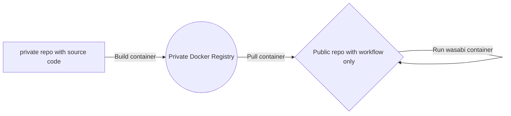

# wasabi getting started!

## overall concept

 - A private repository with the source code inside that allow you to
   build **your own and encrypted** docker container and save it in you
   private container registry.
 - A public repository that contains the
   workflow **only** for running your docker container

# Private repo

## Create a private repository

Create a private repository with a random name, free up your fantasy there.
**Note**: *make sure that repo name **do not contains underscore "_" and white space " "** characters. 

Remember also to flag "**Private**" radio button!

## Upload source code

All your files and folders are inside the ZIP package I shared with you.

1. **Unzip** the package
2. **Upload** all the extracted files and folders in your private repo and do not forget to do commit!
**Note**: *.github folder is hidden,  make sure to upload it or create manually!*

## Do settings

3. Once upload is completed, go in *settings/actions/general* and **activate Read and Write permissions** in Workflow permissions section.
4. Go in *settings/secrets/actions* and **create new repository secret**, name it **GPG_PASSPHRASE** and set your favorite password. *This key will be used to encrypt the files inside the docker container, only you know the password and only you will be able to run the container.*

## Create your docker container

5. Go in *actions* tab, select **Container Build**, than *Run workflow*, it should take 2 minutes more or less.
 **Note**: *Container Build is the only workflow needed here, you you have others, please disable them to avoid useless runs!*
 **Note**: *Somtime, tools inside the container will become olds, you have just to *Run workflow* again to update all versions!*

# Public repo

This repository will contain just one single generic yml file and **nothing else**!

## Create a public repository

Create a private repository with a random name, free up your fantasy.
**Note**: *chosing the name consider this will be public and visible to all* 

Remember also to flag "**Public**" radio button!

## Add workflow

 1. Create a file, type directly .github/worklflows/workflow_container.yml in the name of the file, put here the content I shared with you and do not forget to do commit!
  **Note**: *You can also upload the file, as you wish.*
  **Note**: *You can also download the latest version of the workflow file from my public repository**
  **Note**: *Remember to change the schedule cron settings as you prefer and che worklow name if you want**

schedule sample:

    schedule:
    - cron: "30 8,11 * * *" #Runs at 8:30 and 11:30 UTC everyday

## Do settings

### Secrets
Go in *settings/secrets/actions* and **create new repository secrets** as follow:

Mandatories
- **GPG_PASSPHRASE** and set same password used in the same key inside the private repo.
- **MATRIX** 
- **CONTAINER_IMAGE** and set the url that you can see in packages section. Like ghcr.io/<github_account>/<private_repo>:latest (**without https:// and all lowercase!**)

Optionals
- **TELEGRAM_API_TOKEN** 
- **TELEGRAM_USERID** 
- **GOOGLE_SHEETS_SHEET_ID** 
- **GOOGLE_SHEETS_TAB_NAME** 
- **GOOGLE_SHEETS_CREDENTIALS_B64**
- **GOOGLE_SHEETS_TOKEN_B64** 
- **AZURE_CREDENTIALS** 

### Permissions
Now we have to allow the action inside this repo to read the docker container created from the private repo.

 1. Go in **You profile**
 2. Click **Packages**
 3. Click the package create before, will have the name of your private repo
 4. Go in **Package settings**
 5. **Add Repository** in *Manage Actions access* section
 6. Select your public repository; Read access will be enough.
